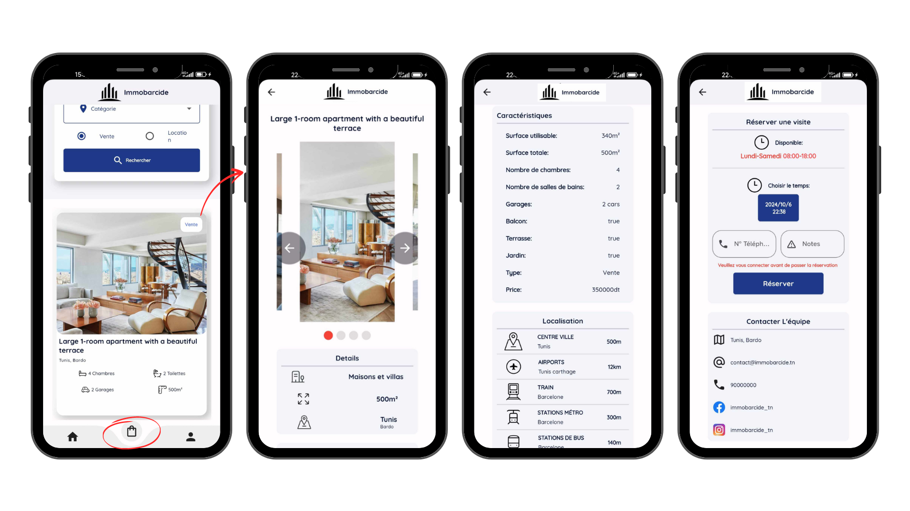
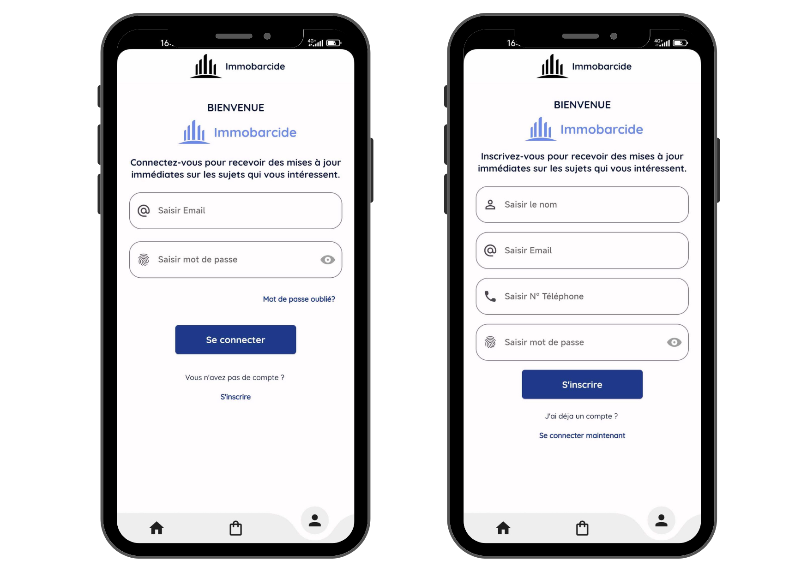
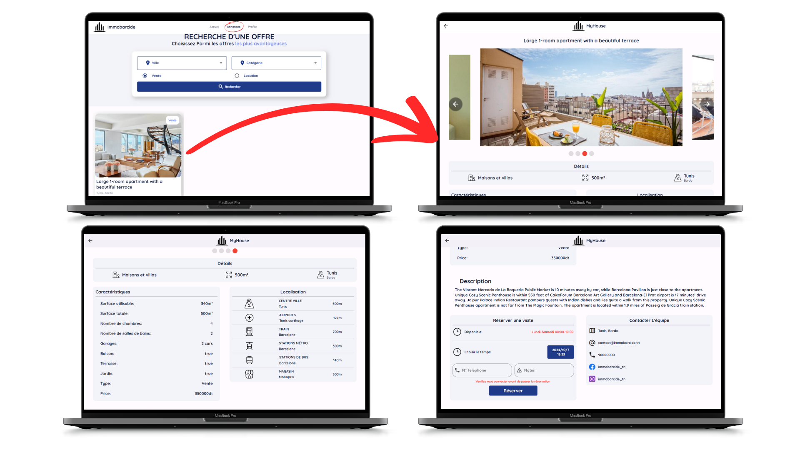
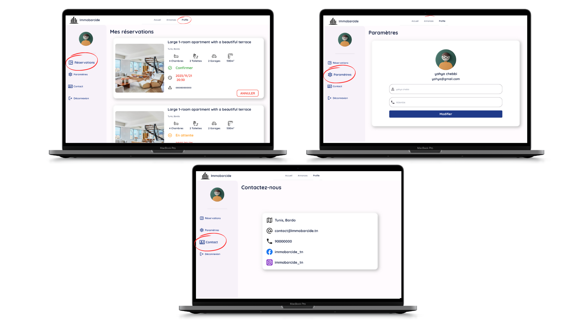

# Cross-Platform Real Estate Rental and Sales Application


This system allows clients to browse real estate listings, schedule property viewings, and receive confirmation or rejection from agents. The admin dashboard enables agents to manage listings and reservations.

## Applications


### Mobile Application
A simplified, on-the-go version of the web app, allowing clients to browse listings and schedule viewings directly from their mobile devices.

### Web Application
Clients can view and filter property listings, and make viewing reservations through a user-friendly interface.

### Admin Dashboard
Agents can add new property listings, manage existing ones, and approve or reject viewing reservations, ensuring a smooth operation.

## Screenshot
### Mobile Application





### Web Application






### Admin Dashboard


## Tech Stack

- **Flutter**: For building cross-platform mobile applications.
- **Dart**: The programming language used for Flutter apps.
- **Firebase**: Used for real-time data synchronization and storage.

## How to Run

### Apps Setup:

1. Clone the repository:
   ```bash
   git clone https://github.com/ChebbiYahya/Cross-Platform-Real-Estate-Rental-and-Sales-Application.git

2. Navigate to the project directory:
   ```bash
   cd immobarcide-app

3. Install dependencies:
   ```bash
   flutter pub get

4. Run the app:
   ```bash
   flutter run